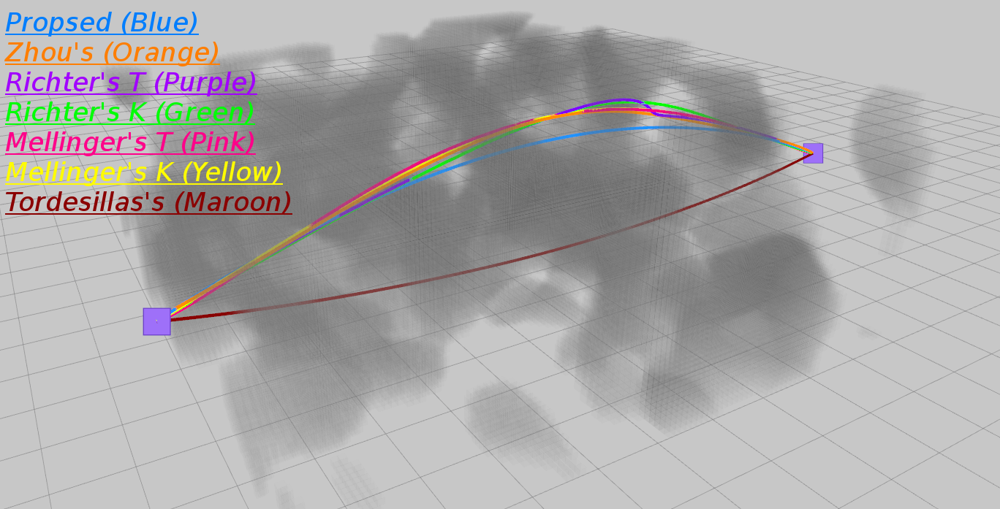

# TGK-Planner
TGK-Planner: An Efficient Topology Guided Kinodynamic Planner for Autonomous Quadrotors

## Update
A newer version is in [here](https://github.com/ZJU-FAST-Lab/kino_sampling_with_regional_opti).

##  About
__TGK-Planner__ is a hierarchical trajectory planner for multirotors with a sampling-based kinodynamic front-end and an optimization back-end.
It can serve as a global kinodynamic planner to find asymptotically optimal trajectories or as a local kinodynamic planner for quick replans.

__Authors__: [Hongkai YE](https://kyleyehh.github.io/) and [Fei GAO](https://ustfei.com/) from the [ZJU Fast Lab](http://www.kivact.com/).

__Related Paper__:
[Arxiv Preprint](https://arxiv.org/abs/2008.03468) (Accepted by IEEE RA-L)

__Video Links__: [Youtube](https://youtu.be/nNS0p8h5zAk), [Bilibili](https://www.bilibili.com/video/BV1gA411e7DH) (For Mainland China)

<p align="center">
  
  
  
  
</p>

# Run The Simulation
The repo has been tested on Ubuntu 16.04 and 18.04 with ros-desktop-full installation.

## 1. Prerequisites
The __uav_simulator__ depends on the C++ linear algebra library [Armadillo](http://arma.sourceforge.net/). You can install it by:
```
~$ sudo apt-get install libarmadillo-dev
``` 
## 2. Build on ROS
We recommand create a new catkin workspace:
```
~$ mkdir -p tgk_ws/src
```
Change directory to _~/tgk_ws/src_ and clone the repo:
```
~$ cd tgk_ws/src
~/tgk_ws/src$ git clone https://github.com/ZJU-FAST-Lab/TGK-Planner.git
```
Change directory to _~/tgk_ws_ and make:
```
~/tgk_ws/src$ cd ..
~/tgk_ws$ catkin_make
```

## 3. Run 
In directory _~/tgk_ws_, set up the environment and launch the simulator:
```
~/tgk_ws$ source devel/setup.bash
~/tgk_ws$ roslaunch state_machine rviz.launch
```

Open another terminal, set up the environment and launch the planner:
```
~/tgk_ws$ source devel/setup.bash
~/tgk_ws$ roslaunch state_machine planning.launch
```
If everything goes well, you should be able to navigate the drone as the gif shows below. (Click 3D Nav Goal in the Rviz panel or press g in keyboard to selecet goal. Click down both left and right mouse buttons and drag to change the goal altitude.)

<p align="center">
  
</p>

By default, the global map is known, and the space outside a certain local bound is treated as free.


# Use Onboard Sensors

To acquire more realistic simulations, a GPU-based onboard depth camera sensor simulator can be enabled by changing the CMakeLists.txt in the package __depth_sensor_simulator__ as below and then re-compile. (Do not foget to change the 'arch' and 'code' flags according to your graphics card devices. You can check the right code [here](https://github.com/tpruvot/ccminer/wiki/Compatibility).)
```
#set(ENABLE_CUDA false)
set(ENABLE_CUDA true)
...
list(APPEND CUDA_NVCC_FLAGS -arch=sm_30)
list(APPEND CUDA_NVCC_FLAGS -gencode arch=compute_30,code=sm_30)
```
Set the __occ_map/use_global_map__ param in __planning.launch__ to false and re-launch both __rviz.launch__ and __rviz.launch__ as before.
```
<param name="occ_map/use_global_map" value="false" type="bool"/>
```
Now the map is built on instant depth observations.
<p align="center">
  
</p>

## Main Params That Affect Performance
In planning.launch:
```
# Smaller rho means more aggressive maneuvers and higher flying speed.
<param name="krrt/rho" value="0.13" type="double"/> 

# It should decrease as rho increases.
<param name="sampler/vel_mag_mean" value="3.0" type="double" />

# Time budget for replan. More time budget leads to higher quality trajectories.
<param name="fsm/replan_time" value="0.05" type="double"/> RRT*
```
In simulator.launch:
```
# Obstacle numbers.
<param name="map/obs_num" value="550"/>    
<param name="map/circle_num" value="100"/>   
```
# Acknowledgements
We use a self developed [Root-Finder](https://github.com/ZJU-FAST-Lab/Root-Finder) to solve polynomial equations.

# Licence
The source code is released under [GPLv3](http://www.gnu.org/licenses/) license.

# Maintaince
The peoject is under maintaince.

For any technical issues, please contact Hongkai YE (hkye@zju.edu.cn, kyle_yeh@163.com) or Fei GAO (fgaoaa@zju.edu.cn).